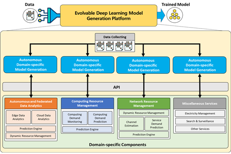
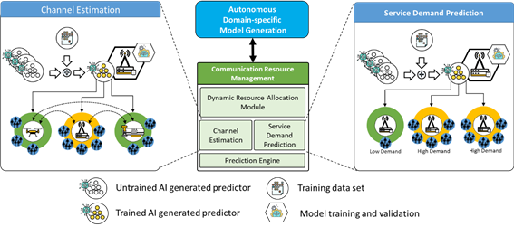
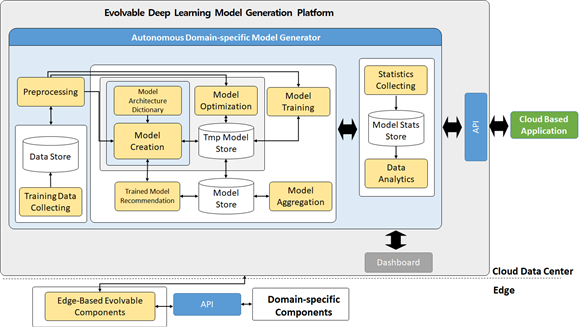

# Deep-Learning-Model-Generator
Deep Learning Model Generator

엣지 컴퓨팅용 진화형 딥러닝 모델 생성 플랫폼 개발

◎ 지속적인 진화가 가능한 Domain Specific 학습 모델 생성 플랫폼

Federated Learning Structure 

엣지 컴퓨팅 환경에서 데이터 분석, 예측, 분류, 의사결정, 영상처리, 무선자원 할당 등 도메인에 특화된 문제 해결을 지원하는 Evolvable Deep Learning Model 생성 플랫폼인 Evolvable Deep Learning Model Generation Platform(EDL)

문제 해결을 위하여 어떤 데이터가 입력되더라도 입력 데이터에 특화된 모델 즉, 도메인 특화 모델을 생성하여 문제 해결이 가능함

## Version
python 3.8
Pytorch 1.8.0

## License
Copyright (c) 2019 Networking Intelligence
Redistribution and use in source and binary forms, with or without modification, are permitted provided that the following conditions are met:

1. Redistributions of source code must retain the above copyright notice, this list of conditions and the following disclaimer.

2. Redistributions in binary form must reproduce the above copyright notice, this list of conditions and the following disclaimer in the documentation and/or other materials provided with the distribution.

THIS SOFTWARE IS PROVIDED BY THE COPYRIGHT HOLDERS AND CONTRIBUTORS "AS IS" AND ANY EXPRESS OR IMPLIED WARRANTIES, INCLUDING, BUT NOT LIMITED TO, THE IMPLIED WARRANTIES OF MERCHANTABILITY AND FITNESS FOR A PARTICULAR PURPOSE ARE DISCLAIMED. IN NO EVENT SHALL THE COPYRIGHT HOLDER OR CONTRIBUTORS BE LIABLE FOR ANY DIRECT, INDIRECT, INCIDENTAL, SPECIAL, EXEMPLARY, OR CONSEQUENTIAL DAMAGES (INCLUDING, BUT NOT LIMITED TO, PROCUREMENT OF SUBSTITUTE GOODS OR SERVICES; LOSS OF USE, DATA, OR PROFITS; OR BUSINESS INTERRUPTION) HOWEVER CAUSED AND ON ANY THEORY OF LIABILITY, WHETHER IN CONTRACT, STRICT LIABILITY, OR TORT (INCLUDING NEGLIGENCE OR OTHERWISE) ARISING IN ANY WAY OUT OF THE USE OF THIS SOFTWARE, EVEN IF ADVISED OF THE POSSIBILITY OF SUCH DAMAGE.
